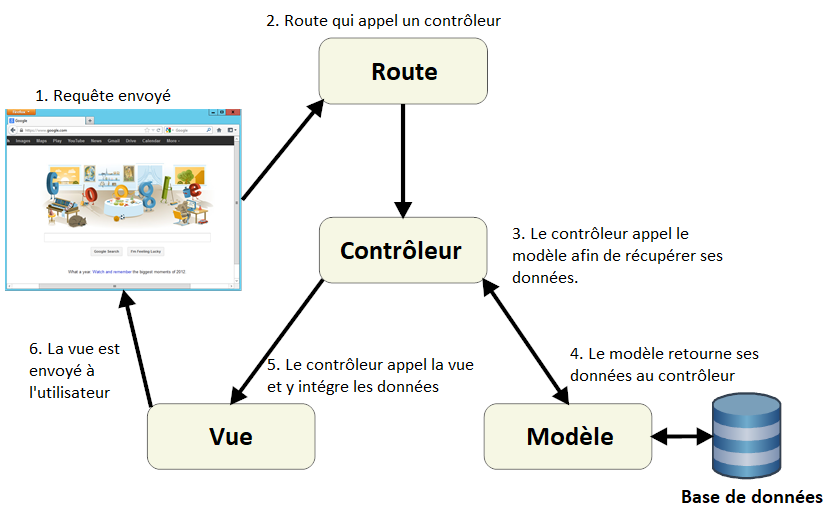
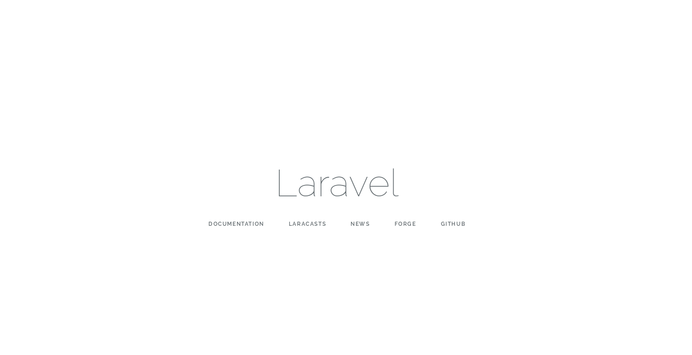
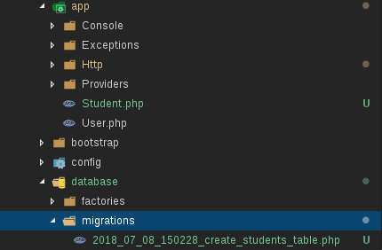
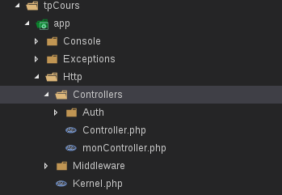
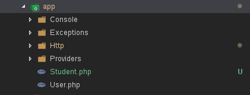

# Cours Laravel

Je vais vous présenter le framework **Laravel**, l'un des framework les plus utilisés sur le marché.

## Présentation de l'architecture MVC



1. L'internaute transmet une requête en se dirigeant sur le site.
1. La route permet d'appeler un contrôleur.
1. Le contrôleur appelle un modèle (une classe PHP). Le rôle de ce dernier est de récupérer des données (souvent dans la base de données) et d'appeler une (ou plusieurs) vue.
1. Le modèle retourne les données au contrôleur.
1. Le contrôleur appelle la vue et se charger d'intégrer les données dans le HTML.
1. Le HTML final est envoyé à l'utilisateur afin qu'il puisse consulter le site normalement.

## Présentation du Framework PHP Laravel

Laravel est un framework web open-source écrit en PHP respectant le principe de l'architecture MVC et entièrement développé en programmation orientée objet. Laravel est distribué sous licence MIT, avec ses sources hébergées sur GitHub.

*Pour plus d'infos :*

[Wikipédia FR](https://fr.wikipedia.org/wiki/Laravel)

[Wikipédia EN](https://en.wikipedia.org/wiki/Laravel)

## LE TP LARAVEL !!! ON VA ENFIN S'AMUSER ! :smiley:

*Vous dormiez ? :sleeping:*
*Si c'est le cas vous pouvez vous réveiller !*

### Installation de Composer

https://getcomposer.org/download/ 

Windows : 

Télécharger le composer-setup.exe et l’installer. 

Linux : 

En lignes de commandes : 

```
php -r "copy ('https://getcomposer.org/installer', 'composer-setup.php');" 

php -r "if (hash_file ('SHA384', 'composer-setup.php') === '544e09ee996cdf60ece3804abc52599c22b1f40f4323403c44d44fdfdd586475ca9813a858088ffbc1f233e9b180f061') {echo 'Installateur vérifié';} else {echo 'Installer corrupt'; unlink ('composer-setup. php ');} echo PHP_EOL; " 

php composer-setup.php 

php -r "unlink ('composer-setup.php');" 
```

Installation local : 

Se diriger dans le répertoire souhaité puis effectuer la commande suivante : 

`php composer.phar`

### Installation de Laravel

https://laravel.com/docs/5.6

### Windows : 

Effectuer la ligne de commande suivante pour DL Laravel via composer : 

`composer global require "laravel/installer"` 

Une fois installé,  la commande suivante permettra de créer une install Laravel dans le répertoire spécifié : 

`laravel new nom_dossier`

### Linux :

Effectuer la commande suivante pour installer Laravel via composer : 

`composer create-project --prefer-dist laravel/laravel nom_du_projet`

### Serveur web

Une fois l'installation de Laravel terminée on và lancer le server avec cette commande :

`php artisan serve`

Si tout s'est bien passé, en vous rendant sur `http://127.0.0.1:8000` vous devriez avoir cet affichage :



### La base de données

#### Créer la base de données

Il faut se rendre sur phpMyAdmin et créer sa base de données.

Donnez lui le nom que vous voulez, moi je vais l'appeler "cours-laravel".

#### Le fichier de configuration

Pour que **Laravel** sache qu'elle base de données vous souhaitez utiliser et qu'il puisse s'y connecter, il faut ouvrir le fichier de configuration `.env` et le paramétrer.

Ce fichier se trouve à la racine du projet.

*Note: Le fichier `.env` est probablement un fichier caché.*

```
DB_CONNECTION=mysql
DB_HOST=127.0.0.1
DB_PORT=3306
DB_DATABASE=cours-laravel
DB_USERNAME=root
DB_PASSWORD=motDePasse
```

Le champ DB_DATABASE correspond au nom de votre base de données.
Le champ DB_USERNAME correspond à votre identifiant.
Le champ DB_PASSWORD correspond à votre mot de passe.

#### Les migrations

Nous allons maintenant créer une migration avec cette ligne de commande :

`php artisan make:migration create_students_table`

*Note : `create_students_table` est le nom de ma table de migration, vous pouvez l'appeler comme vous le souhaitez.*

Le fichier de migration est créé dans le dossier `database/migrations`.

Une fois la migration créer, on và l'ouvrir dans le dossier **database** puis dans le dossier **migrations**



Dans notre migration, on a une une fonction "up" :

```php
public function up()
{
    Schema::create('students', function (Blueprint $table) {
        $table->increments('id');
        $table->timestamps();
    });
}
```

Il faut rajouter deux champs un champ *firstname* et un champ *lastname* comme ceci :

```php
public function up()
{
    Schema::create('students', function (Blueprint $table) {
        $table->increments('id');
        $table->string('firstname');
        $table->string('lastname');
        $table->timestamps();
    });
}
```

On peut constater qu'on à déjà deux tables de migrations présentes. C'est Laravel qui nous les a implémenter à la construction du projet.
Voici ces deux migrations :

- `create_users_table.php`
- `create_password_resets_table`

Comme nous n'en avons pas besoin dans ce petit tp, on và les supprimer.


On peut vérifier les status de nos migrations pour avoir une idée des migrations que l'on a déjà effectuée ou non :

`php artisan migrate:status`

Maintenant, pour pouvoir effectuer la migration on và taper cette ligne de commande :

`php artisan migrate`

Si on refait ici la commande `php artisan migrate:status` on voit bien que maintenant la migration a était effectuée (si il n'y a pas eu d'erreur lors de la commande précédente bien évidemment).

### Erreur `SQLSTATE[42000]: Syntax error or access violation: 1071 Specified key was too long; max key length is 767 bytes`

Ouvrez le fichier `app/Providers/AppServiceProvider.php`, et modifier le bloc :

```
public function boot()
{
    //
}
```

afin d'obtenir :

```
public function boot()
{
    Schema::defaultStringLength(191);
}
```

### Les routes

On se dirige dans le dossier des **routes**


On ouvre le fichier route `routes/web.php`.

Ecrivez la ligne

```php
Route::get('/', 'MonController@accueil');
```

Que fait cette ligne ? Elle và appeler le contrôleur **MonController** et la function **accueil** de ce contrôleur.

Si on essaye d'accéder à l'adresse `http://127.0.0.1:8000/test`

On a une erreur car le contrôleur n'existe pas encore.
On và donc le créer avec une ligne de commande.

### Le contrôleur

On và écrire cette ligne afin de générer automatiquement le contrôleur.
`php artisan make:controller MonController`

*Note : `MonController` est le nom du controller, vous pouvez l'appeler comme vous le souhaitez.*

Les contrôleurs sont créer dans le dossier `app/Http/Controllers`.



On a bien nôtre nouveau contrôleur `monController.php` dans le dossier `app/Http/Controllers`.

On và maintenant créer la fonction accueil dans le contrôleur qui affichera `Hello World !` juste pour vérifier que le contrôleur fonctionne correctement.

```php
public function accueil()
{
    echo 'Hello World !';
}
```

Pour respecter l'architecture MVC, le contrôleur appel une vue. Nous allons donc appeler une vue depuis le contrôleur.
La vue que l'on và appeler n'existe pas encore mais on và la créer juste après.

On và remplacer `echo 'Hello World !';` par `return view('hello')';` dans notre fonction accueil du contrôleur `app/Http/Controllers/MonController`.

```php
public function accueil()
{
    return view('hello');
}
```

Ainsi on và retourner la vue `hello` (qui devra être dans le fichier `resources/views/hello.blade.php`).

### La vue

Pour créer la vue, il faut se rendre dans `resources/views` puis créer un fichier `hello.blade.php`.

On và ensuite modifier cette vue et y écrire un petit peu de HTML.

```html
<!DOCTYPE html>
<html lang="en">
    <head>
        <meta charset="UTF-8">
        <meta name="viewport" content="width=device-width, initial-scale=1.0">
        <meta http-equiv="X-UA-Compatible" content="ie=edge">
        <title>Accueil</title>
    </head>
    <body>
        <p>Hello World !</p>
    </body>
</html>
```

On peut tester à nouveau : `http://127.0.0.1:8000`

On a bien le message "Hello World !" d'afficher via la vue.

### Le modèle

Pour créer notre modèle qui và se charger de récupérer des données par la suite.

On và écrire dans notre terminal :

`php artisan make:model Student`

*Note : `Student` est le nom du modèle, vous pouvez l'appeler comme vous le souhaitez.*



Maintenant qu'on a créer une route, un contrôleur et une vue, on và pouvoir passer au CRUD !

### Insérer des étudiants dans la BDD

Nous allons insérer des étudiants dans la base de données.

#### Modification du fichier route web.php

Pour insérer des données, on và ajouter une route dans **web.php**

```php
Route::get('/add-student', 'StudentsController@ajout');
```

#### Création d'un contrôleur StudentsController

On và maintenant créer un contrôleur **StudentsController** encore une fois avec la commande :
`php artisan make:controller StudentsController`

Dans ce contrôleur, on và remplacer la ligne (qui ne nous sert pas)
```php
use Illuminate\Http\Request;
```
par
```php
use App\Student;
```
Qui và nous éviter de tomber sur une erreur php de type **FatalThrowableError** *Class 'App\Http\Controllers\App\Student' not found...*

Pourquoi `use App\Student;` permet d'éviter cette erreur ?
Parce que *use* donne un chemin absolu, donc à partir de la racine du projet on retourne dans *App\Student*.

On và également ajouter une fonction ajout() qui và permettre d'afficher la page d'ajout des étudiants :

```php
<?php

namespace App\Http\Controllers;

use App\Student;

class StudentsController extends Controller
{
    public function ajout()
    {
        return view('ajoutStudent');
    }
```

#### Création d'une vue layout.blade.php

On và créer un fichier **layout** avec **blade** à savoir que blade est un peu l'équivalent de **twig** pour **Symfony**.
Pour se faire on se dirige dans le dossier *resources/views* puis on ajoute un nouveau fichier qu'on và appeler **layout.blade.php**

Dans se fichier on à une grande partie du code HTML que l'on utilise souvent !

```php
<!doctype html>
<html lang="{{ app()->getLocale() }}">
    <head>
        <meta charset="utf-8">
        <meta http-equiv="X-UA-Compatible" content="IE=edge">
        <meta name="viewport" content="width=device-width, initial-scale=1">
        <title>Laravel</title>
    </head>
    <body>
        <div class="container">

            @yield('contenu')
        </div>
    </body>
</html>
```
Le `@yield('contenu')` permet de dire que le contenu sera affiché ici.

#### Création d'une vue ajoutStudent

Maintenant on và devoir créer la vue **ajoutStudent** qui contiendra un formulaire afin d'ajouter un étudiant dans la base de données.

```php
@extends('layout')

@section('contenu')

    <h1>Ajouter un étudiant ici :</h1>
    <form action="/students" method="post">
        {{ csrf_field() }}

        <input type="text" name="lastname" placeholder="Nom">
        <input type="text" name="firstname" placeholder="Prénom">
        <input type="submit" value="Ajout d'un étudiant">
    </form>
@endsection
```

`{{ csrf_field() }}` est une sécuritée Laravel a ajouter dans nos formulaire.

*Note : csrf pour cross-site request forgery*
[Plus d'infos sur Wikipédia EN](https://en.wikipedia.org/wiki/Cross-site_request_forgery)
[Plus d'infos sur Wikipédia FR](https://fr.wikipedia.org/wiki/Cross-site_request_forgery)

Maintenant si on vérifie http://127.0.0.1:8000/add-student on à bien un formulaire de deux champs avec un bouton.

Le formulaire ne fonctionne pas encore pourquoi ? Parce qu'actuellement on a simplement fait "affiche se formulaire via la méthode GET".

Pour traiter les données du formulaire, on và ajouter une route POST.

#### Ajout d'une nouvelle route

On và ajouter une nouvelle route qui và nous permettre d'utiliser une méthode POST pour le contrôleur afin de traiter les données envoyés via le formulaire.

```php
Route::post('/students', 'StudentsController@traitementAjout');
```

#### Ajout d'une nouvelle fonction dans StudentsController

Ajout d'une fonction traitementAjout() qui comme précisé précédemment permettra de traiter les données du formulaire.

```php
public function traitementAjout()
    {
        $student = Student::create([
            'firstname' => request('firstname'),
            'lastname' => request('lastname'),
        ]);
    
        return 'Formulaire validé';
    }
```
#### Modification du modèle Student

Dans notre class Student, on và ajouter une ligne :

```php
class Student extends Model
{
    protected $fillable = ['firstname', 'lastname'];
}
```
Cette ligne permet de dire à Laravel "Les champs firstname et lastname sont autorisés".

On peut tester :smiley: http://127.0.0.1:8000/add-student puis on vérifie dans la base de données.
Normalement tout devrait fonctionner :relieved: !

#### Amélioration du formulaire

Tout fonctionne cependant, l'utilisateur và tomber sur une erreur si il n'entre pas de nom et de prénom.
On và donc améliorer notre formulaire. Pour se faire, on và se rendre dans **StudentsController.php** puis dans la fonction traitementAjout() on và ajouter :
```php
    public function traitementAjout()
    {
        request()->validate([
            'firstname' => ['required'],
            'lastname' => ['required'],
        ]);
```

On a donc maintenant :
```php
    public function traitementAjout()
    {
        request()->validate([
            'firstname' => ['required'],
            'lastname' => ['required'],
        ]);
        
        $student = Student::create([
            'firstname' => request('firstname'),
            'lastname' => request('lastname'),
        ]);
    
        return 'Formulaire validé';
    }
```

Désormais il n'est plus possible de valider le formulaire sans remplir de champs. Cependant nous n'avons pas de message qui s'affiche, on và donc modifier ça dans la vue **ajoutStudent.blade.php** en ajoutant une condition blade.

*Note : Laravel nous fournis par défaut une variable $errors dans toute nos vues qui contient les erreurs si il y en a.*

On và ajouter sous le premier input :
```php
@if($errors->has('firstname'))
    <p>{{ $errors->first('firstname') }}</p>
@endif
```
puis on fait la même chose pour le deuxième champs :
```php
@if($errors->has('lastname'))
    <p>{{ $errors->first('lastname') }}</p>
@endif
```

On a donc une vue qui ressemble à ça :

```php
@extends('layout')

@section('contenu')

    <h1>Ajouter un étudiant ici :</h1>
    <form action="/students" method="post">
        {{ csrf_field() }}

        <input type="text" name="firstname" placeholder="Nom">
        @if($errors->has('firstname'))
            <p>{{ $errors->first('firstname') }}</p>
        @endif
        <input type="text" name="lastname" placeholder="Prénom">
        @if($errors->has('lastname'))
            <p>{{ $errors->first('lastname') }}</p>
        @endif
        <input type="submit" value="Ajout d'un étudiant">
    </form>
@endsection
```

Maintenant si on essaye à nouveau d'entrer un étudiant, on a bien un message d'erreur pour le champs concerné.

On và également ajouter `value="{{ old('firstname') }}` et `value="{{ old('lastname') }}` aux deux input afin de conserver la dernière valeur entrer si on a une erreur (cela évite à l'utilisateur de tout retaper ce qui serait une mauvaise pratique). 

Notre vue ressemble donc à cela maintenant :

```php
@extends('layout')

@section('contenu')

    <h1>Ajouter un étudiant ici :</h1>
    <form action="/students" method="post">
        {{ csrf_field() }}

        <input type="text" name="firstname" placeholder="Nom" value="{{ old('lastname') }}" >
        @if($errors->has('firstname'))
            <p>{{ $errors->first('firstname') }}</p>
        @endif
        <input type="text" name="lastname" placeholder="Prénom" value="{{ old('firstname') }}" >
        @if($errors->has('lastname'))
            <p>{{ $errors->first('lastname') }}</p>
        @endif
        <input type="submit" value="Ajout d'un étudiant">
    </form>
@endsection
```

### Afficher des étudiants dans la BDD

Nous allons maintenant afficher les étudiants de la base de données.

#### Modification du fichier route web.php

Pour se faire, on và se rendre à nouveau dans le fichier route **web.php** (dans le dossier routes).

Puis on và créer une route qui appel un contrôleur comme ceci :

```php
Route::get('/students', 'StudentsController@afficher');
```

#### Modification du contrôleur StudentsController

On và maintenant de nouveau se rendre dans le contrôleur **StudentsControlleur**

On và y ajouter :

```php
public function afficher()
{
    $students = Student::all();


    return view('students', [
        'students' => $students
    ]);
}
```

#### Ajout d'une nouvelle vue students

Nous allons créer une vue **students.blade.php** qui và nous permettre d'afficher nos étudiants.

```php
@extends('layout')

@section('contenu')
<h1>Liste des étudiants</h1>

<ul>
    @foreach($students as $student)
        <li>{{ $student->firstname }} {{ $student->lastname }}</li>
    @endforeach
</ul>
@endsection
```

Avec `@extends('layout')`, on a le fichier code HTML du fichier **layout.blade.php**. C'est un peu comme un `include();` en php.
Ensuite dans `@section('contenu')` on a notre contenu qui est affiché.

#### Ajout d'une redirection sur le contrôleur StudentsController

Maintenant qu'on a une page qui permet d'afficher les données de notre BDD, on và effectuer une redirection sur notre ancienne fonction de traitement de données afin d'avoir une redirection la page de notre liste d'étudiants lorsqu'on vient d'ajouter un étudiant.

Pour se faire, dans notre contrôleur **StudentsController** il suffit simplement de remplacer le `return 'Formulaire validé';` par `return redirect('students');`

Prochainement... Mettre à jour des étudiants dans la BDD
